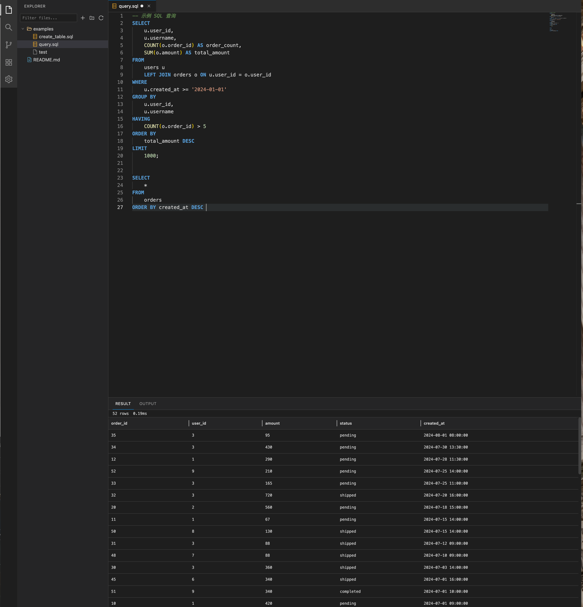
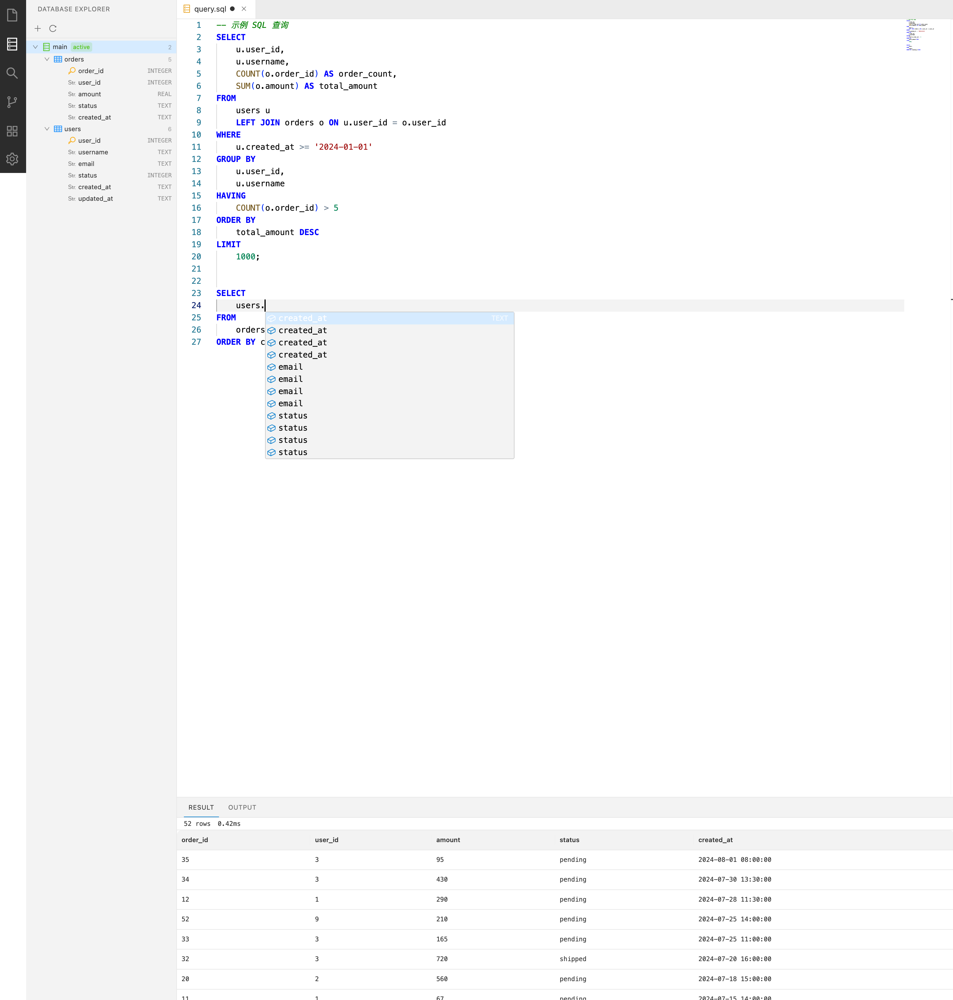

# Data Dev IDE

一个基于 Web 的轻量级数据研发 IDE，支持 SQL 编辑、执行和结果展示。仿 VS Code 布局，提供文件管理、代码编辑、SQL 执行等核心功能。



### SQL 智能补全



## 技术栈

| 层级 | 技术 |
|------|------|
| 前端框架 | React 18 + TypeScript |
| 代码编辑器 | Monaco Editor |
| SQL 解析 | ANTLR4 (antlr4ng) + Code Completion Core (antlr4-c3) |
| UI 组件库 | Ant Design |
| 状态管理 | Zustand |
| 构建工具 | Vite |
| 后端服务 | Express + WebSocket |
| 数据库 | SQLite (better-sqlite3) |
| 工程化 | Turborepo + pnpm Monorepo |
| 代码规范 | ESLint + Prettier + Husky |

## 项目结构

```
data-dev-ide/
├── packages/
│   ├── client/                 # 前端应用 (React + Vite)
│   │   └── src/
│   │       ├── components/     # UI 组件
│   │       ├── features/       # Monaco Editor 配置
│   │       ├── hooks/          # 自定义 Hooks
│   │       ├── layouts/        # 布局组件
│   │       ├── services/       # API 服务层
│   │       ├── stores/         # Zustand 状态管理
│   │       └── styles/         # 主题与全局样式
│   ├── sql-parser/              # SQL 解析引擎 (ANTLR4 + c3)
│   │   └── src/
│   │       ├── antlr/          # ANTLR4 生成的 Lexer/Parser
│   │       └── SqlCompletionService.ts  # 上下文感知补全逻辑
│   ├── server/                 # 后端服务 (Express)
│   │   └── src/
│   │       ├── controllers/    # 请求控制器
│   │       ├── middleware/     # 中间件
│   │       ├── routes/         # 路由定义
│   │       ├── services/       # 业务逻辑
│   │       └── websocket/      # WebSocket 服务
│   └── shared/                 # 共享类型定义
│       └── src/types/          # TypeScript 类型
├── docs/                       # 文档资源
├── turbo.json                  # Turborepo 配置
└── pnpm-workspace.yaml         # pnpm 工作空间
```

## 快速启动

### 环境要求

- Node.js >= 18
- pnpm >= 9

### 安装与运行

```bash
# 安装依赖
pnpm install

# 启动开发服务（前后端同时启动）
pnpm dev
```

启动后访问 `http://localhost:5173`

## 功能特性

### 代码编辑器
- 基于 Monaco Editor，支持语法高亮、智能提示、代码折叠
- 多 Tab 页管理，支持预览模式 / 固定 Tab
- 深色/浅色主题切换
- 文件自动保存与脏状态标记

### SQL 智能补全 (IntelliSense)
- 基于 ANTLR4 + c3 的上下文感知补全
- `db.` 触发该库下所有表名补全
- `table.` 或 `alias.` 触发该表所有字段补全（支持别名解析）
- `FROM` / `JOIN` 后优先补全表名
- `SELECT` / `WHERE` / `ON` 后补全已引用表的字段
- SQL 关键词、函数、类型、Snippets 补全

### Database Explorer
- 左侧 Activity Bar 数据库面板，树形展示 Database → Table → Column
- 支持创建、切换、删除多个 SQLite 数据库
- 双击表名自动插入 `SELECT * FROM table LIMIT 100;` 到编辑器
- DDL 执行后自动刷新 Schema 元数据

### SQL 执行
- 内置 SQLite 数据库，支持真实 SQL 执行
- 预置 demo 数据（users 表 + orders 表）
- 支持 SELECT 查询和 DDL/DML 语句
- 底部 Result 面板展示查询结果（列名、行数、耗时）
- 支持选中部分 SQL 执行

### 文件管理
- 树形文件浏览器，支持文件/文件夹的增删改查
- 文件搜索（Quick Open）
- 文件变更实时同步（WebSocket）

### 布局系统
- VS Code 风格布局：Activity Bar + Side Panel + Editor + Bottom Panel
- 面板拖拽调整大小
- 面板显示/隐藏切换

## 快捷键

| 快捷键 | 功能 |
|--------|------|
| `⌘ + Enter` | 执行 SQL（全文或选中部分） |
| `⌘ + S` | 保存当前文件 |
| `⌘ + P` | 快速打开文件 |
| `⌘ + B` | 切换侧边栏 |
| `⌘ + J` | 切换底部面板 |
| `⇧ + ⌥ + F` | 格式化文档 |

## API 接口

| 方法 | 路径 | 说明 |
|------|------|------|
| GET | `/api/v1/files/tree` | 获取文件树 |
| GET | `/api/v1/files/read?path=` | 读取文件内容 |
| POST | `/api/v1/files/create` | 创建文件/文件夹 |
| PUT | `/api/v1/files/update` | 更新文件内容 |
| PUT | `/api/v1/files/rename` | 重命名 |
| DELETE | `/api/v1/files/delete?path=` | 删除文件 |
| GET | `/api/v1/files/search?q=` | 搜索文件 |
| POST | `/api/v1/sql/execute` | 执行 SQL |
| GET | `/api/v1/sql/databases` | 列出所有数据库 |
| POST | `/api/v1/sql/databases` | 创建新数据库 |
| PUT | `/api/v1/sql/databases/active` | 切换活跃数据库 |
| DELETE | `/api/v1/sql/databases/:name` | 删除数据库 |
| GET | `/api/v1/sql/schemas` | 获取 Schema 元数据 |

## License

MIT
